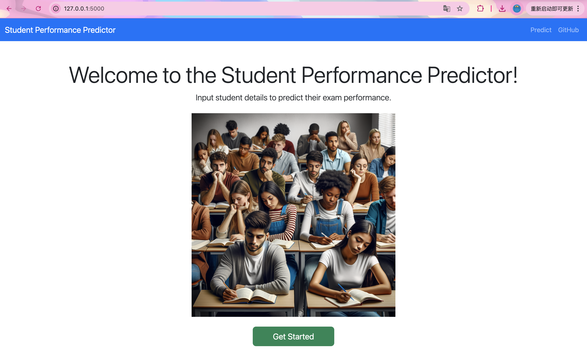
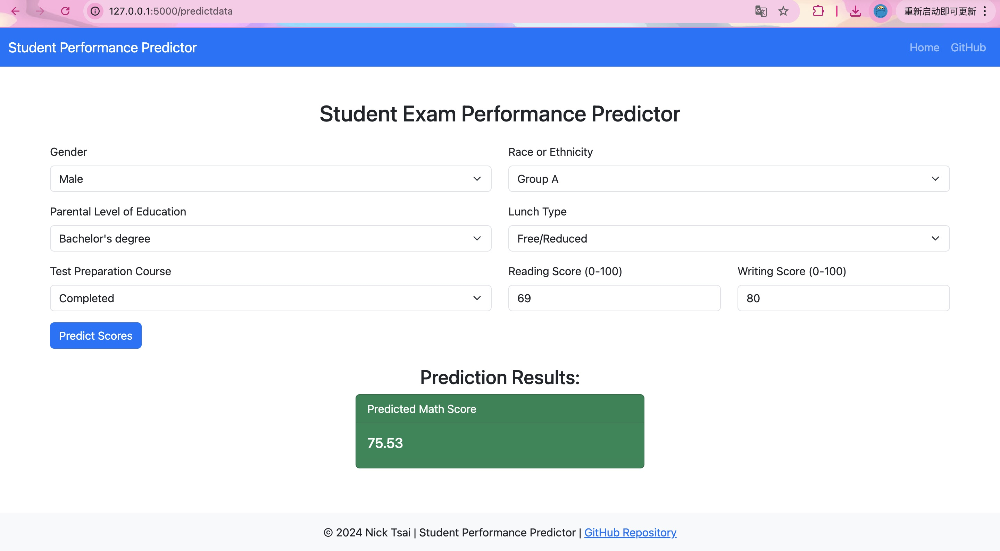

# Predicting Student Performance: An End-to-End Machine Learning Project with Azure Deployment

## Overview

This project addresses the challenge of predicting student performance in exams by analyzing how various factors such as gender, ethnicity, parental education level, lunch status, and test preparation courses influence test scores. Leveraging the "Students Performance in Exams" dataset from Kaggle, I developed and evaluated multiple machine learning models, employing feature engineering techniques to enhance predictive accuracy. The project encompasses data preprocessing, exploratory data analysis, model selection, hyperparameter tuning, and deployment on Microsoft Azure.

## Screenshot of UI


*Caption: User interface of the Student Performance Prediction web application.*


*Caption: Enter features to get the predicted score.*

## Table of Contents

- [Project Motivation](#project-motivation)
- [Dataset and Features](#dataset-and-features)
- [Methodology](#methodology)
- [How to Run](#how-to-run)
- [Future Work](#Future-work)
- [References](#references)

## Project Motivation

Driven by a strong passion in education, I embarked on this project to:

- **Enhance Predictive Modeling Skills:** Gain practical experience in developing and deploying machine learning models tailored to educational data.
- **Address Real-World Educational Challenges:** Provide actionable insights into factors affecting student performance, aiding educators and policymakers in decision-making.
- **Demonstrate Comprehensive Data Science Expertise:** Showcase abilities in data analysis, feature engineering, model development, and cloud deployment.

## Dataset and Features

- **Dataset Source:** [Students Performance in Exams | Kaggle](https://www.kaggle.com/datasets/spscientist/students-performance-in-exams?datasetId=74977)
- **Description:** The dataset comprises 8 columns and 1000 rows, detailing various attributes of students and their corresponding exam scores.
- **Key Features:**
  - **Demographic Features:**
    - **Gender:** Male or Female
    - **Ethnicity:** Grouped into categories (e.g., Group A, Group B, etc.)
    - **Parental Level of Education:** Highest education level achieved by parents
  - **Socioeconomic Features:**
    - **Lunch:** Whether the student receives free/reduced lunch or not
    - **Test Preparation Course:** Completion status of a test preparation course
  - **Performance Metrics:**
    - **Math Score:** Score in Mathematics
    - **Reading Score:** Score in Reading
    - **Writing Score:** Score in Writing

## Methodology

**Exploratory Data Analysis Notebook**
- Link: [EDA Notebook](notebook/EDA_STUDENT_PERFORMANCE.ipynb)

**Model Training Notebook**
- Link: [Model Training Notebook](notebook/MODEL_TRAINING.ipynb)

## Results and Analysis

- **Model Performance:**
  - The **Random Forest Regressor** achieved the highest R² score of **0.85** on the test set, outperforming the baseline **Linear Regression** model by **20%** in terms of MAE.

- **Key Insights:**
  - **Test Preparation Course Completion** was the most significant factor influencing student performance.
  - **Parental Level of Education** and **Lunch Status** also played crucial roles in determining exam scores.

- **Visualizations:**
  - 
  *Caption: Comparison of MAE across different regression models.*

  - 
  *Caption: Feature importance plot from the Random Forest model.*

## How to Run

### Prerequisites

- **Python 3.8**
- **Git**
- **Conda**

### Steps to Run Locally

1. **Clone the Repository:**
    ```bash
    git clone https://github.com/Nick14848/mlproject.git
    cd mlproject
    ```

2. **Create and Activate a Conda Environment:**
    ```bash
    conda create -p venv python==3.8 -y
    conda activate venv/
    ```

3. **Install Dependencies:**
    ```bash
    pip install -r requirements.txt
    ```

4. **Run the Application:**
    ```bash
    python application.py
    ```
    - This will start the Flask web application.
    - Open your web browser and navigate to [http://127.0.0.1:5000/](http://127.0.0.1:5000/) to interact with the application.

### Running the Deployed Application

- Access the deployed web application [here](https://nick-studentperformance-dcfedpbmawb0fccs.canadacentral-01.azurewebsites.net/)
- Input the required student attributes to receive performance predictions.
- App might not be available due to potential cost-related limitations on my Azure account.

## Future work

- **Incorporating Additional Features:** Including more granular data such as attendance records, extracurricular activities, and study habits to enhance model accuracy.
- **Advanced Modeling Techniques:** Experimenting with deep learning architectures and ensemble methods to further boost predictive performance.
- **Real-Time Analytics Dashboard:** Developing an interactive dashboard using **Power BI** or **Tableau** for educators to monitor and analyze student performance trends.
- **A/B Testing and Continuous Deployment:** Implementing A/B testing strategies to evaluate the effectiveness of the deployed model in real-world educational settings and facilitating continuous integration and deployment practices.

## References

- **Youtube Tutorials**
  - [Krish Naik](https://www.youtube.com/@krishnaik06)

- **Dataset:**
  - [Students Performance in Exams | Kaggle](https://www.kaggle.com/datasets/spscientist/students-performance-in-exams?datasetId=74977)
  
- **Machine Learning Resources:**
  - [Scikit-learn Documentation](https://scikit-learn.org/stable/documentation.html)

- **Data Visualization:**
  - [Matplotlib Documentation](https://matplotlib.org/stable/contents.html)
  - [Seaborn Documentation](https://seaborn.pydata.org/)
---